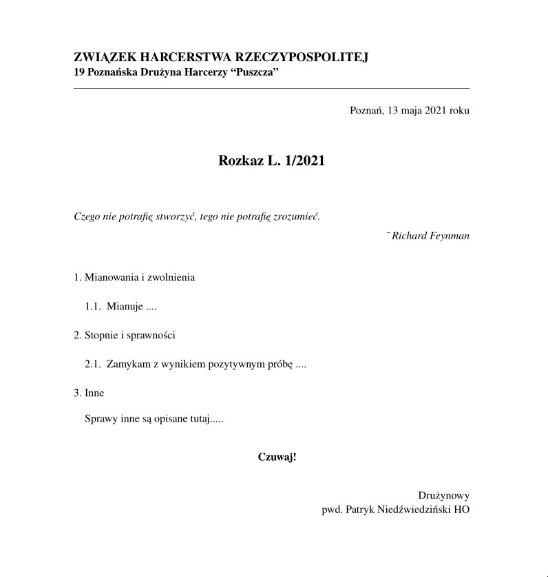

# rozkaz.tmac

[http](https://zhr.niedzwiedzinski.cyou/rozkaz.tmac/)

Neatroff macro do pisania harcerskich rozkazów = najszybsza i najskuteczniejsza metoda.

## Po co?

Bo neatroff jest szybki i lekki. Poniższy przykład wyrenderował się na 10-letnim kompie w 230 **milisekund** - to jest całkiem szybko. Neatroff waży 16M, co nie da się w ogóle porównać z 1GB, które zajmuje LaTeX.

UPDATE: teraz jest logo lilijki, co jest trochę problematyczne i trudniejsze, dlatego teraz zajmuje ~800 milisekund. :(

## Makra

- .DRUŻYNA - nagłówek
- .DATA - data w narożniku
- .ROZKAZ - numer rozkazu
- .CYTAT - przyjmuje 2 argumenty: cytat i autor cytatu
- .CZUWAJ - wyśrodkowane "Czuwaj!"

Przykładowy plik: `l1.2021.ms`

```
.DRUŻYNA 19 Poznańska Drużyna Harcerzy “Puszcza”
.DATA Poznań, 13 maja 2021 roku
.ROZKAZ L. 1/2021
.CYTAT "Czego nie potrafię stworzyć, tego nie potrafię zrozumieć." "Richard Feynman"

1. Mianowania i zwolnienia

1.1. Mianuje ....

2. Stopnie i sprawności

2.1. Zamykam z wynikiem pozytywnym próbę ....

3. Inne

Sprawy inne są opisane tutaj.....

.CZUWAJ

.ad r
Drużynowy
.sp 0.1
pwd. Patryk Niedźwiedziński HO
.br
```


[pdf](l1.2021.pdf)

## Instalacja i używanie

Musisz zainstalować [neatroff](https://github.com/pniedzwiedzinski/neatroff_install).

Gdy już masz zainstalowanego neatroff'a, to pobierz to repo, aby `rozkaz` był w `$PATH`:

```
sudo cp zhr.pdf /opt/share/neatroff
sudo cp rozkaz.tmac /opt/share/neatroff/tmac
sudo cp rozkaz /usr/bin/rozkaz
```

```
rozkaz l1.2021.ms > l1.2021.pdf
```
